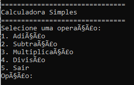
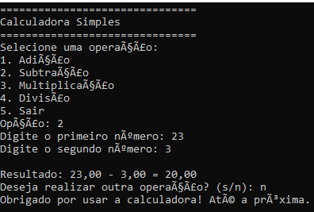

# 📟 Calculadora Simples em C

Uma calculadora simples desenvolvida em linguagem C, capaz de realizar as quatro operações básicas: adição, subtração, multiplicação e divisão. O projeto foi criado com baseado no projeto "Calculadora Baseada em Texto em C" do Neps Academy.



## 🚀 Instalação e Pré-requisitos

### Pré-requisitos

- Sistema Operacional: Windows, Linux ou macOS
- Compilador C (gcc ou equivalente)

### Instalação

1. Clone o repositório:
```bash
git clone https://github.com/seu-usuario/calculadora-simples-c.git
```

2. Acesse a pasta do projeto:
```bash
cd calculadora-simples-c
```

3. Compile o código:
```bash
gcc main.c -o calculadora
```

4. Execute:
```bash
./calculadora
```

## ⚙️ Uso e Exemplos

Ao rodar o programa, você poderá escolher a operação desejada e inserir os números conforme o menu apresentado. Será mostrado o resultado da operação, e você tem a opção de executar novamente outra operação:



Exemplo de comando no terminal:
```bash
./calculadora
```

## 📁 Estrutura do Projeto

```
calculadora-simples-c/
│── main.c
│── README.md
│── LICENSE
└── assets/
    └── printMenu.png
    └── exemploDemonstracao.png
```

- **main.c**: Código-fonte da calculadora.
- **README.md**: Documentação do projeto.
- **LICENSE**: Licença de uso.
- **assets/**: Pasta contendo imagens para demonstração.

## 📄 Licença

Este projeto está licenciado sob a Licença MIT - veja o arquivo [LICENSE](LICENSE) para mais detalhes.
