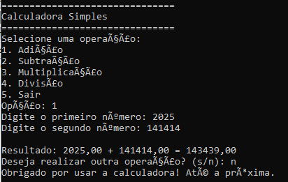
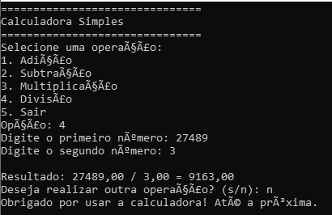

# 📟 Calculadora de Texto em C

Uma calculadora simples desenvolvida em linguagem C, capaz de realizar as quatro operações básicas: adição, subtração, multiplicação e divisão. O projeto foi criado com base no projeto "Calculadora Baseada em Texto em C" do Neps Academy.


## 🖥️ Demonstração

Abaixo, você pode ver uma demonstração real do funcionamento da calculadora em um terminal:


O programa exibe um menu, permite ao usuário escolher a operação desejada da operação e informa o resultado de forma clara e objetiva, com a opção de realizar novamente!

## 🚀 Instalação e Pré-requisitos

### Pré-requisitos

- Sistema Operacional: Windows, Linux ou macOS
- Compilador C (gcc ou equivalente)

### Instalação

1. Clone o repositório:
```bash
git clone https://github.com/seu-usuario/calculadora-simples-c.git
```

2. Acesse a pasta do projeto:
```bash
cd calculadora-simples-c
```

3. Compile o código:
```bash
gcc main.c -o calculadora
```

4. Execute:
```bash
./calculadora
```

## ⚙️ Uso e Exemplos

Ao rodar o programa, você poderá escolher a operação desejada e inserir os números conforme o menu apresentado.

### Exemplos práticos:

📌Exemplo 1: Adição (captura abaixo)
O usuário escolhe a opção 1, insere os números 2025 e 141414, e recebe o resultado:
```
Resultado: 2025 + 141414 = 143449,00
```


📌Exemplo 2: Divisão (captura abaixo)  
O usuário escolhe a opção 4, insere 27489 e 3, e recebe:
```
Resultado: 27489,00 / 3,00 = 9163,00
```


O programa então pergunta se o usuário deseja realizar outra operação!

## 📁 Estrutura do Projeto

```
calculadora-simples-c/
│── main.c
│── README.md
│── LICENSE
└── assets/
    ├── printMenu.png
    └── exemploDemonstracao.png
    └── adicaoExemplo.png
    └── divisaoExemplo.png
```

- **main.c**: Código-fonte da calculadora.
- **README.md**: Documentação do projeto.
- **LICENSE**: Licença de uso.
- **assets/**: Imagens para demonstração visual.

## 📄 Licença

Este projeto está licenciado sob a Licença MIT - veja o arquivo [LICENSE](LICENSE) para mais detalhes.
